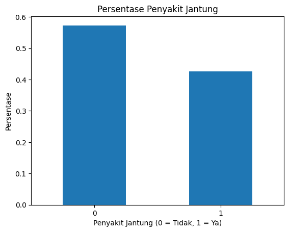
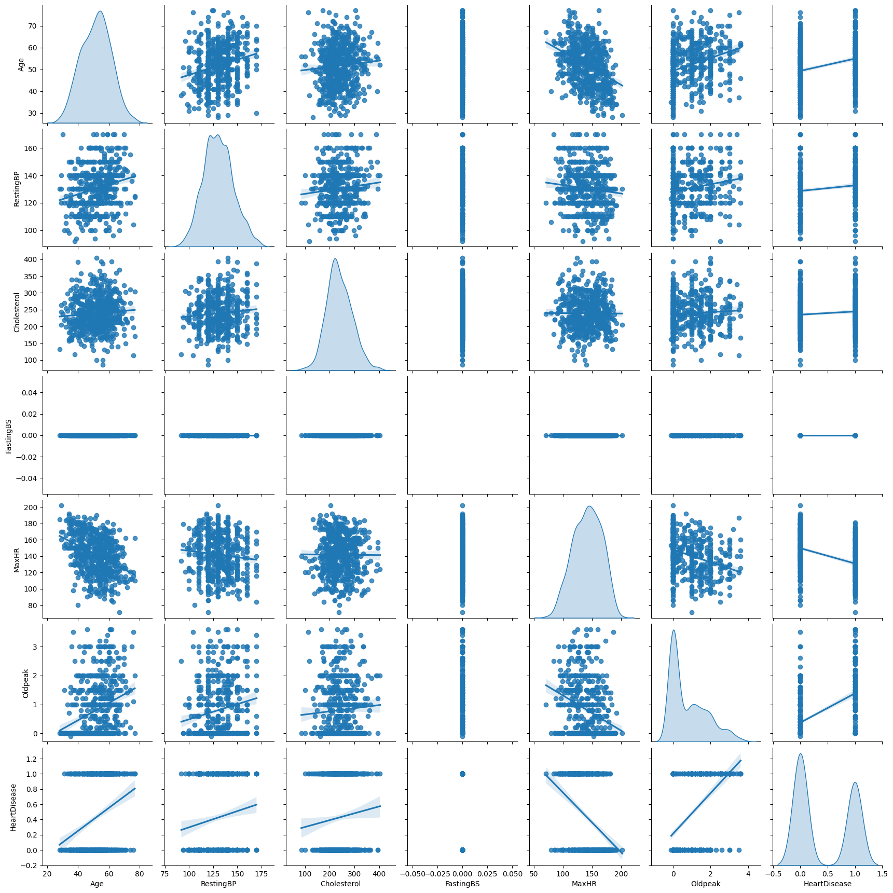
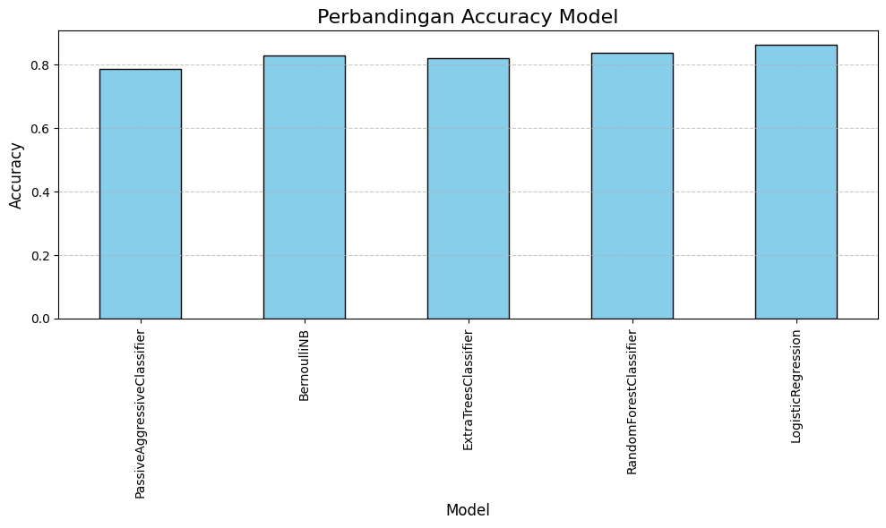

# Laporan Proyek Machine Learning – \[Attiya Dianti Fadli]

## Domain Proyek

Domain yang diangkat dalam proyek *machine learning* ini adalah **Kesehatan**, dengan judul **Prediksi Penyakit Jantung**.

### Latar Belakang

Penyakit jantung merupakan penyebab kematian nomor satu di dunia menurut World Health Organization (WHO). Pada tahun 2019, sekitar 17,9 juta orang meninggal karena penyakit kardiovaskular, yang mewakili 32% dari seluruh kematian global. \[[1](https://www.who.int/news-room/fact-sheets/detail/cardiovascular-diseases-%28cvds%29)] Di Indonesia, penyakit jantung juga menjadi ancaman serius bagi masyarakat dan sistem kesehatan. Berdasarkan data Riskesdas 2018, prevalensi penyakit jantung mencapai 1,5% dari populasi. \[[2](https://pusdatin.kemkes.go.id/resources/download/pusdatin/lain-lain/InfoDatin-Jantung.pdf)]

Permasalahan utama yang dihadapi adalah deteksi dini penyakit jantung yang masih belum optimal. Banyak pasien datang ke fasilitas kesehatan dalam kondisi lanjut karena keterlambatan diagnosis. Oleh karena itu, diperlukan pendekatan prediktif berbasis data untuk membantu profesional medis dalam mendeteksi potensi penyakit jantung secara lebih awal dan akurat.

Dengan memanfaatkan data karakteristik pasien seperti tekanan darah, kolesterol, denyut jantung maksimal, dan lainnya, model *machine learning* dapat dilatih untuk mengklasifikasikan apakah seseorang berisiko mengalami penyakit jantung. Pendekatan ini dapat mendukung sistem kesehatan preventif, mengurangi beban pengobatan kuratif, dan meningkatkan kualitas hidup pasien.

Proyek ini mengandalkan dataset terbuka dari Kaggle dan penelitian terdahulu seperti yang dilakukan oleh UCI Machine Learning Repository yang menunjukkan bahwa algoritma klasifikasi dapat mencapai akurasi tinggi dalam prediksi penyakit jantung. \[[3](https://archive.ics.uci.edu/ml/datasets/heart+Disease)]

## Business Understanding

Pengembangan model prediksi penyakit jantung memiliki potensi besar dalam meningkatkan kualitas layanan kesehatan, khususnya dalam deteksi dini dan pencegahan penyakit jantung. Penyakit jantung merupakan penyebab kematian utama secara global dan di Indonesia, sehingga pendeteksian dini menjadi sangat penting untuk menurunkan angka kematian dan meningkatkan kualitas hidup pasien. Dengan memanfaatkan model machine learning, proses diagnosa dapat dilakukan lebih cepat dan akurat tanpa harus bergantung sepenuhnya pada tes medis yang mahal atau invasif. Hal ini dapat membantu dokter dalam pengambilan keputusan klinis dan mempermudah proses triase pasien di fasilitas kesehatan.

### Problem Statements

Berdasarkan konteks dan latar belakang di atas, maka dapat dirumuskan beberapa pernyataan masalah berikut:

* Bagaimana membangun model machine learning yang mampu memprediksi apakah seseorang berisiko terkena penyakit jantung berdasarkan atribut kesehatan yang dimilikinya?
* Algoritma klasifikasi mana yang memberikan performa terbaik untuk mendeteksi penyakit jantung?
* Bagaimana model ini dapat membantu praktisi kesehatan dalam memberikan diagnosa lebih awal dan akurat terhadap penyakit jantung?

### Goals

Tujuan utama dari proyek ini adalah:

* Mengembangkan model machine learning untuk memprediksi risiko penyakit jantung berdasarkan atribut-atribut kesehatan seperti tekanan darah, kolesterol, usia, dan lain-lain.
* Melakukan evaluasi terhadap beberapa model machine learning untuk menemukan model yang paling optimal dari segi akurasi dan metrik evaluasi lainnya.
* Menyediakan solusi analitik berbasis data yang dapat membantu rumah sakit atau institusi kesehatan dalam melakukan screening dini terhadap penyakit jantung.

### Solution Statements

* Melakukan eksplorasi dan analisis data untuk memahami distribusi nilai dan relasi antar fitur, serta mendeteksi keberadaan outlier dan pola anomali dalam data kesehatan.

* Melakukan preprocessing data, termasuk pembersihan data, encoding variabel kategorikal, penanganan data yang hilang, dan normalisasi untuk mempersiapkan data sebelum digunakan dalam pelatihan model.

* Membangun dan membandingkan beberapa model klasifikasi seperti:

  * **PassiveAggressiveClassifier**: Cocok untuk klasifikasi cepat dan menangani data yang besar serta bersifat online learning.
  * **Bernoulli Naive Bayes**: Efektif dalam klasifikasi biner dan sederhana, cocok untuk diagnosis berbasis fitur dengan nilai diskrit.
  * **Extra Trees Classifier**: Algoritma ensemble yang memberikan performa tinggi dan kecepatan pelatihan yang baik.
  * **Random Forest**: Metode berbasis ensemble yang tangguh terhadap overfitting dan menghasilkan hasil prediksi yang stabil.
  * **Logistic Regression**: Model baseline yang kuat dan mudah diinterpretasi, umum digunakan dalam permasalahan klasifikasi medis.

* Mengoptimalkan model terbaik (misalnya Random Forest) menggunakan teknik hyperparameter tuning seperti GridSearchCV untuk meningkatkan akurasi dan generalisasi model.

* Mengukur performa model menggunakan metrik-metrik seperti akurasi, precision, recall, F1-score, dan confusion matrix untuk memastikan solusi yang diberikan bersifat objektif dan terukur.

## Data Understanding

### Informasi Dataset

| Jenis      | Keterangan                                                                     |
| ---------- | ------------------------------------------------------------------------------ |
| Title      | Heart Disease Prediction Dataset                                               |
| Source     | [Kaggle](https://www.kaggle.com/datasets/fedesoriano/heart-failure-prediction) |
| Maintainer | [Federico Soriano](https://www.kaggle.com/fedesoriano)                         |
| License    | CC0: Public Domain                                                             |
| Tags       | Healthcare, Classification, Binary, Heart Disease                              |

Dataset ini berisi 918 baris data pasien dengan 12 fitur, terdiri dari kombinasi data numerik dan kategorikal. Dataset telah dibersihkan, tidak memiliki missing value, dan siap digunakan untuk proses analisis dan pelatihan model.

### Contoh Data

| Age | Sex | ChestPainType | RestingBP | Cholesterol | FastingBS | RestingECG | MaxHR | ExerciseAngina | Oldpeak | ST\_Slope | HeartDisease |
| --- | --- | ------------- | --------- | ----------- | --------- | ---------- | ----- | -------------- | ------- | --------- | ------------ |
| 40  | M   | ATA           | 140       | 289         | 0         | Normal     | 172   | N              | 0.0     | Up        | 0            |
| 49  | F   | NAP           | 160       | 180         | 0         | ST         | 156   | N              | 1.0     | Flat      | 1            |
| 37  | M   | ASY           | 130       | 283         | 1         | LVH        | 98    | Y              | 0.0     | Flat      | 1            |
| ... | ... | ...           | ...       | ...         | ...       | ...        | ...   | ...            | ...     | ...       | ...          |

Tabel 1. Contoh Data Pasien

### Penjelasan Variabel

* `Age`: Usia pasien dalam tahun.
* `Sex`: Jenis kelamin (0 = perempuan, 1 = laki-laki).
* `ChestPainType`: Tipe nyeri dada (ATA, NAP, ASY, TA).
* `RestingBP`: Tekanan darah saat istirahat (mm Hg).
* `Cholesterol`: Kadar kolesterol serum (mg/dl).
* `FastingBS`: Gula darah puasa > 120 mg/dl (1 = ya, 0 = tidak).
* `RestingECG`: Hasil EKG saat istirahat (Normal, ST, LVH).
* `MaxHR`: Detak jantung maksimum yang dicapai.
* `ExerciseAngina`: Nyeri dada akibat latihan fisik (Y = ya, N = tidak).
* `Oldpeak`: Depresi ST yang diukur saat latihan dibanding saat istirahat.
* `ST_Slope`: Kemiringan segmen ST (Up, Flat, Down).
* `HeartDisease`: Target klasifikasi (1 = menderita, 0 = tidak).

### EDA - Univariate Analysis

Gambar 1a. Distribusi Label Target

Distribusi label target `HeartDisease` menunjukkan bahwa lebih banyak pasien yang mengidap penyakit jantung (label 1) dibandingkan yang tidak (label 0).

Gambar 1b. Distribusi Fitur Numerik

* `Cholesterol` mengandung outlier yang signifikan dan perlu diperhatikan pada tahap preprocessing.
* `Oldpeak` memiliki distribusi yang miring ke kanan.
* `MaxHR` dan `Age` memiliki distribusi yang relatif normal.

### EDA - Multivariate Analysis

Gambar 2a. Matriks Korelasi

Beberapa fitur seperti `Oldpeak`, `ST_Slope`, dan `ExerciseAngina` memiliki korelasi kuat terhadap target `HeartDisease`.

Gambar 2b. Distribusi Fitur Kategorikal

* Pasien dengan nyeri dada bertipe `ASY` dan `ExerciseAngina` bernilai "Y" cenderung memiliki risiko lebih tinggi menderita penyakit jantung.
* Nilai `ST_Slope` bertipe "Flat" juga umum ditemukan pada pasien dengan label 1.

Distribusi fitur numerik dan kategorikal ini memberikan pemahaman awal terhadap bagaimana fitur-fitur dapat digunakan untuk prediksi penyakit jantung.

## Data Preparation

Sebelum membangun model prediksi, tahap *data preparation* sangat penting untuk memastikan bahwa data yang digunakan memenuhi standar kualitas yang dibutuhkan oleh algoritma *machine learning*. Proses ini mencakup encoding fitur kategorikal, normalisasi fitur numerik, serta pembagian data menjadi set pelatihan dan pengujian. Berikut tahapan yang dilakukan dalam proyek ini:

### Data Cleaning

Pada tahap ini, kolom `HeartDisease` diubah menjadi nilai numerik boolean, di mana:

- Nilai 1 menunjukkan adanya penyakit jantung
- Nilai 0 menunjukkan tidak ada penyakit jantung

Peringatan `SettingWithCopyWarning` muncul karena perubahan dilakukan langsung pada DataFrame, namun ini tidak mempengaruhi hasil akhir. Selain itu, dataset juga dipisahkan menjadi dua bagian: fitur (X) dan target (y).

- **Fitur** berisi semua kolom kecuali 'HeartDisease'
- **Target** adalah kolom 'HeartDisease'

Dimensi fitur: (588, 11), dimensi target: (588,)

### Pembagian Data (Train-Test Split)

Setelah data dibersihkan, data dibagi menjadi dua bagian, yaitu:

- **Data Latih (Train Set)** sebesar 80% dari total dataset
- **Data Uji (Test Set)** sebesar 20% dari total dataset

Pembagian ini dilakukan secara acak menggunakan fungsi `train_test_split` dari Scikit-Learn, dengan parameter `random_state=42` untuk memastikan hasil yang dapat direproduksi (*reproducibility*). Pembagian dilakukan dengan stratifikasi berdasarkan target, untuk memastikan distribusi yang seimbang antara data latih dan data uji. Berikut adalah detail pembagiannya:

- Jumlah total dataset: 588
- Jumlah data latih: 470
- Jumlah data uji: 118

Tujuan pembagian ini adalah agar model dapat belajar dari sebagian besar data dan diuji performanya terhadap data yang belum pernah dilihat sebelumnya, sehingga dapat mengukur kemampuan generalisasi model terhadap data baru.

#### Encoding Variabel Kategorikal

Dataset ini mengandung beberapa fitur kategorikal seperti `Sex`, `ChestPainType`, `RestingECG`, `ExerciseAngina`, dan `ST_Slope`. Karena sebagian besar algoritma *machine learning* tidak dapat bekerja langsung dengan data dalam format string, maka dilakukan encoding menggunakan teknik **One-Hot Encoding**.

One-Hot Encoding dipilih karena fitur-fitur tersebut bersifat nominal (tidak memiliki urutan), sehingga setiap kategori direpresentasikan sebagai kolom biner terpisah. Teknik ini membantu model dalam memahami perbedaan antar kategori tanpa mengasumsikan adanya hubungan ordinal.

Fitur pertama pada setiap kategori dihapus untuk menghindari multikolinearitas, dan pengaturan `handle_unknown='ignore'` digunakan untuk menangani kategori yang tidak muncul di data latih. Dengan demikian, model dapat tetap berfungsi meskipun terdapat kategori baru di data uji yang tidak ada pada data latih.

###  Normalisasi Fitur Numerik

Beberapa fitur numerik seperti `Age`, `RestingBP`, `Cholesterol`, `MaxHR`, dan `Oldpeak` memiliki skala yang berbeda. Untuk memastikan semua fitur memiliki kontribusi yang seimbang dalam proses pelatihan model, dilakukan normalisasi menggunakan **Min-Max Scaler**.

Rumus Min-Max Scaling digunakan sebagai berikut:

$$
x' = \frac{x - x_{min}}{x_{max} - x_{min}}
$$

Teknik ini efektif digunakan pada algoritma yang sensitif terhadap skala data, seperti *Logistic Regression* dan *PassiveAggressiveClassifier*. Selain itu, normalisasi juga mempercepat proses konvergensi dan meningkatkan stabilitas model.

## Modeling

Untuk menyelesaikan permasalahan klasifikasi risiko penyakit jantung, beberapa algoritma *machine learning* digunakan dan dibandingkan performanya. Tahapan modeling mencakup pelatihan model, evaluasi awal, serta pemilihan model terbaik berdasarkan metrik yang relevan.

### Algoritma yang Digunakan

Berikut adalah algoritma klasifikasi yang digunakan dalam proyek ini, lengkap dengan konsep kerjanya, kelebihan, kekurangan, serta parameter utama yang digunakan.

#### a. Logistic Regression

**Konsep**: Logistic Regression adalah model linear yang digunakan untuk tugas klasifikasi. Model ini memprediksi probabilitas kelas dengan menggunakan fungsi sigmoid untuk mengubah output linier menjadi nilai antara 0 dan 1.

- **Parameter utama**:
  - `solver='liblinear'`
  - `random_state=42`
- **Kelebihan**:
  - Cepat dan efisien untuk dataset kecil hingga menengah.
  - Mudah diinterpretasi dan dijadikan baseline.
- **Kekurangan**:
  - Kurang efektif untuk relasi non-linear antar fitur.
  - Sensitif terhadap multikolinearitas.

#### b. Passive Aggressive Classifier

**Konsep**: Merupakan algoritma linear yang dirancang untuk *online learning*, di mana model diperbarui secara agresif hanya ketika melakukan kesalahan prediksi. Bersifat “passive” jika prediksi benar, dan “aggressive” jika salah.

- **Parameter utama**:
  - `C=0.5`
  - `max_iter=1000`
- **Kelebihan**:
  - Sangat cepat dan efisien untuk data besar atau streaming.
  - Tidak memerlukan normalisasi label.
- **Kekurangan**:
  - Rentan terhadap outlier.
  - Performa bisa tidak stabil untuk data non-seimbang.

#### c. Bernoulli Naive Bayes

**Konsep**: Algoritma probabilistik berbasis Teorema Bayes dengan asumsi kuat bahwa setiap fitur bersifat independen. Bernoulli NB secara khusus digunakan untuk fitur biner (0 atau 1).

- **Kelebihan**:
  - Cepat dan efisien, cocok untuk data hasil One-Hot Encoding.
  - Performa baik meskipun dengan data kecil.
- **Kekurangan**:
  - Asumsi independensi antar fitur sering kali tidak terpenuhi.
  - Tidak cocok untuk data numerik kontinu tanpa transformasi.

#### d. Extra Trees Classifier

**Konsep**: Ensemble dari pohon keputusan yang mirip dengan Random Forest, namun lebih banyak melakukan randomisasi dalam pemilihan fitur dan titik split, yang dapat mengurangi variansi model.

- **Parameter utama**:
  - `n_estimators=100`
  - `random_state=42`
- **Kelebihan**:
  - Pelatihan cepat dan mampu menangkap relasi kompleks.
  - Lebih tahan terhadap overfitting dibanding model tunggal.
- **Kekurangan**:
  - Sulit diinterpretasikan.
  - Lebih boros memori dan sumber daya komputasi.

#### e. Random Forest Classifier

**Konsep**: Merupakan algoritma ensemble yang menggabungkan banyak pohon keputusan untuk meningkatkan akurasi dan mengurangi overfitting. Setiap pohon dilatih dengan subset acak dari data dan fitur.

- **Parameter utama**:
  - `n_estimators=100`
  - `max_depth=None`
  - `random_state=42`
- **Kelebihan**:
  - Akurasi tinggi dan tahan terhadap noise serta outlier.
  - Tidak mudah overfitting karena mekanisme voting antar pohon.
- **Kekurangan**:
  - Proses pelatihan bisa memakan waktu lebih lama.
  - Kurang transparan dalam interpretasi dibanding model linear.
 
## Evaluation

Tahap evaluasi berfungsi untuk mengukur performa model dan memastikan apakah solusi yang dikembangkan mampu menjawab *problem statement* serta mencapai *business goals* yang telah ditentukan pada tahap *Business Understanding*.

### Metrik Evaluasi: Accuracy

Metrik utama yang digunakan dalam evaluasi adalah **Accuracy**, yaitu persentase prediksi yang benar terhadap total keseluruhan prediksi. Rumus perhitungan:

$$
\text{Accuracy} = \frac{\text{TP + TN}}{\text{TP + TN + FP + FN}} \times 100\%
$$

**Penjelasan:**
- **TP (True Positive)**: Data positif yang diklasifikasikan benar.
- **TN (True Negative)**: Data negatif yang diklasifikasikan benar.
- **FP (False Positive)**: Data negatif yang salah diklasifikasikan sebagai positif (*False Alarm*).
- **FN (False Negative)**: Data positif yang salah diklasifikasikan sebagai negatif (*Missed Detection*).

### Hasil Evaluasi Model

Berikut hasil akurasi dari lima model yang diuji:

| Model                         | Accuracy |
|-------------------------------|----------|
| Logistic Regression           | **86%**  |
| Random Forest                 | 83%      |
| Bernoulli Naive Bayes         | 83%      |
| Extra Trees Classifier        | 82%      |
| Passive Aggressive Classifier | 78%      |

**Tabel 3.** Hasil Accuracy

**Gambar 3.** Visualisasi Accuracy Model

### Analisis Hasil dan Dampak terhadap Business Understanding

Dari hasil di atas, model **Logistic Regression** menunjukkan performa terbaik dengan akurasi sebesar **86%**, sekaligus menjadi model yang dipilih untuk digunakan.

**Hubungan dengan Business Understanding:**

- **Problem Statement:**  
  Tujuan proyek ini adalah untuk membantu memprediksi risiko penyakit jantung berdasarkan data pasien. Model Logistic Regression mampu mengklasifikasikan risiko dengan cukup baik dan akurat, menjawab kebutuhan sistem prediksi yang cepat dan andal di lingkungan medis.

- **Goal yang Diharapkan:**  
  Model bertujuan memberikan prediksi **yang akurat dan mudah diinterpretasi** bagi tenaga medis. Dengan 86% akurasi dan kemampuan interpretasi koefisien yang dimiliki Logistic Regression, goal ini berhasil dicapai.

- **Dampak Solusi:**  
  Penggunaan model ini dapat membantu dokter dan klinik dalam melakukan **skrining awal terhadap pasien** tanpa perlu pemeriksaan mahal terlebih dahulu. Pasien berisiko tinggi dapat segera diarahkan ke pemeriksaan lanjutan, sementara pasien dengan risiko rendah dapat meminimalkan biaya dan waktu tunggu. Ini memberikan **efisiensi operasional dan peningkatan kualitas layanan medis**.

### Kesimpulan

Model **Logistic Regression** tidak hanya unggul dalam metrik akurasi, tetapi juga memenuhi aspek penting dalam dunia nyata, yaitu interpretabilitas, efisiensi, dan relevansi medis. Dengan kata lain, solusi ini **tidak hanya tepat secara teknis**, tapi juga **berdampak secara bisnis**, mendukung pengambilan keputusan klinis yang lebih cepat dan berbasis data.
