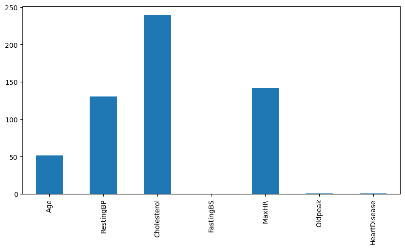
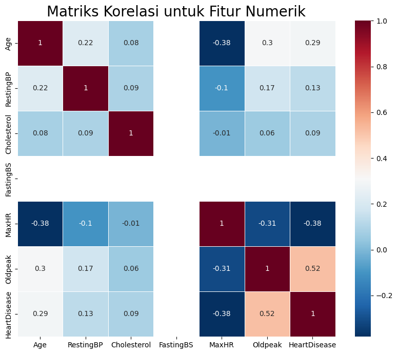

# Laporan Proyek Machine Learning – \[Attiya Dianti Fadli]

## Domain Proyek

Domain yang diangkat dalam proyek *machine learning* ini adalah **Kesehatan**, dengan judul **Prediksi Penyakit Jantung**.

### Latar Belakang

Penyakit jantung merupakan penyebab kematian nomor satu di dunia menurut World Health Organization (WHO). Pada tahun 2019, sekitar 17,9 juta orang meninggal karena penyakit kardiovaskular, yang mewakili 32% dari seluruh kematian global. \[[1](https://www.who.int/news-room/fact-sheets/detail/cardiovascular-diseases-%28cvds%29)] Di Indonesia, penyakit jantung juga menjadi ancaman serius bagi masyarakat dan sistem kesehatan. Berdasarkan data Riskesdas 2018, prevalensi penyakit jantung mencapai 1,5% dari populasi. \[[2](https://pusdatin.kemkes.go.id/resources/download/pusdatin/lain-lain/InfoDatin-Jantung.pdf)]

Permasalahan utama yang dihadapi adalah deteksi dini penyakit jantung yang masih belum optimal. Banyak pasien datang ke fasilitas kesehatan dalam kondisi lanjut karena keterlambatan diagnosis. Oleh karena itu, diperlukan pendekatan prediktif berbasis data untuk membantu profesional medis dalam mendeteksi potensi penyakit jantung secara lebih awal dan akurat.

Dengan memanfaatkan data karakteristik pasien seperti tekanan darah, kolesterol, denyut jantung maksimal, dan lainnya, model *machine learning* dapat dilatih untuk mengklasifikasikan apakah seseorang berisiko mengalami penyakit jantung. Pendekatan ini dapat mendukung sistem kesehatan preventif, mengurangi beban pengobatan kuratif, dan meningkatkan kualitas hidup pasien.

Proyek ini mengandalkan dataset terbuka dari Kaggle dan penelitian terdahulu seperti yang dilakukan oleh UCI Machine Learning Repository yang menunjukkan bahwa algoritma klasifikasi dapat mencapai akurasi tinggi dalam prediksi penyakit jantung. \[[3](https://archive.ics.uci.edu/ml/datasets/heart+Disease)]

## Business Understanding

Pengembangan model prediksi penyakit jantung memiliki potensi besar dalam meningkatkan kualitas layanan kesehatan, khususnya dalam deteksi dini dan pencegahan penyakit jantung. Penyakit jantung merupakan penyebab kematian utama secara global dan di Indonesia, sehingga pendeteksian dini menjadi sangat penting untuk menurunkan angka kematian dan meningkatkan kualitas hidup pasien. Dengan memanfaatkan model machine learning, proses diagnosa dapat dilakukan lebih cepat dan akurat tanpa harus bergantung sepenuhnya pada tes medis yang mahal atau invasif. Hal ini dapat membantu dokter dalam pengambilan keputusan klinis dan mempermudah proses triase pasien di fasilitas kesehatan.

### Problem Statements

Berdasarkan konteks dan latar belakang di atas, maka dapat dirumuskan beberapa pernyataan masalah berikut:

* Bagaimana membangun model machine learning yang mampu memprediksi apakah seseorang berisiko terkena penyakit jantung berdasarkan atribut kesehatan yang dimilikinya?
* Algoritma klasifikasi mana yang memberikan performa terbaik untuk mendeteksi penyakit jantung?
* Bagaimana model ini dapat membantu praktisi kesehatan dalam memberikan diagnosa lebih awal dan akurat terhadap penyakit jantung?

### Goals

Tujuan utama dari proyek ini adalah:

* Mengembangkan model machine learning untuk memprediksi risiko penyakit jantung berdasarkan atribut-atribut kesehatan seperti tekanan darah, kolesterol, usia, dan lain-lain.
* Melakukan evaluasi terhadap beberapa model machine learning untuk menemukan model yang paling optimal dari segi akurasi dan metrik evaluasi lainnya.
* Menyediakan solusi analitik berbasis data yang dapat membantu rumah sakit atau institusi kesehatan dalam melakukan screening dini terhadap penyakit jantung.

### Solution Statements

* Melakukan eksplorasi dan analisis data untuk memahami distribusi nilai dan relasi antar fitur, serta mendeteksi keberadaan outlier dan pola anomali dalam data kesehatan.

* Melakukan preprocessing data, termasuk pembersihan data, encoding variabel kategorikal, penanganan data yang hilang, dan normalisasi untuk mempersiapkan data sebelum digunakan dalam pelatihan model.

* Membangun dan membandingkan beberapa model klasifikasi seperti:

  * **PassiveAggressiveClassifier**: Cocok untuk klasifikasi cepat dan menangani data yang besar serta bersifat online learning.
  * **Bernoulli Naive Bayes**: Efektif dalam klasifikasi biner dan sederhana, cocok untuk diagnosis berbasis fitur dengan nilai diskrit.
  * **Extra Trees Classifier**: Algoritma ensemble yang memberikan performa tinggi dan kecepatan pelatihan yang baik.
  * **Random Forest**: Metode berbasis ensemble yang tangguh terhadap overfitting dan menghasilkan hasil prediksi yang stabil.
  * **Logistic Regression**: Model baseline yang kuat dan mudah diinterpretasi, umum digunakan dalam permasalahan klasifikasi medis.

* Mengoptimalkan model terbaik (misalnya Random Forest) menggunakan teknik hyperparameter tuning seperti GridSearchCV untuk meningkatkan akurasi dan generalisasi model.

* Mengukur performa model menggunakan metrik-metrik seperti akurasi, precision, recall, F1-score, dan confusion matrix untuk memastikan solusi yang diberikan bersifat objektif dan terukur.

## Data Understanding

### Informasi Dataset

| Jenis      | Keterangan                                                                     |
| ---------- | ------------------------------------------------------------------------------ |
| Title      | Heart Disease Prediction Dataset                                               |
| Source     | [Kaggle](https://www.kaggle.com/datasets/fedesoriano/heart-failure-prediction) |
| Maintainer | [Federico Soriano](https://www.kaggle.com/fedesoriano)                         |
| License    | CC0: Public Domain                                                             |
| Tags       | Healthcare, Classification, Binary, Heart Disease                              |

Dataset ini berisi 918 baris data pasien dengan 12 fitur, terdiri dari kombinasi data numerik dan kategorikal. Dataset telah dibersihkan, tidak memiliki missing value, dan siap digunakan untuk proses analisis dan pelatihan model.

### Contoh Data

| Age | Sex | ChestPainType | RestingBP | Cholesterol | FastingBS | RestingECG | MaxHR | ExerciseAngina | Oldpeak | ST\_Slope | HeartDisease |
| --- | --- | ------------- | --------- | ----------- | --------- | ---------- | ----- | -------------- | ------- | --------- | ------------ |
| 40  | M   | ATA           | 140       | 289         | 0         | Normal     | 172   | N              | 0.0     | Up        | 0            |
| 49  | F   | NAP           | 160       | 180         | 0         | ST         | 156   | N              | 1.0     | Flat      | 1            |
| 37  | M   | ASY           | 130       | 283         | 1         | LVH        | 98    | Y              | 0.0     | Flat      | 1            |
| ... | ... | ...           | ...       | ...         | ...       | ...        | ...   | ...            | ...     | ...       | ...          |

Tabel 1. Contoh Data Pasien

### Penjelasan Variabel

* `Age`: Usia pasien dalam tahun.
* `Sex`: Jenis kelamin (0 = perempuan, 1 = laki-laki).
* `ChestPainType`: Tipe nyeri dada (ATA, NAP, ASY, TA).
* `RestingBP`: Tekanan darah saat istirahat (mm Hg).
* `Cholesterol`: Kadar kolesterol serum (mg/dl).
* `FastingBS`: Gula darah puasa > 120 mg/dl (1 = ya, 0 = tidak).
* `RestingECG`: Hasil EKG saat istirahat (Normal, ST, LVH).
* `MaxHR`: Detak jantung maksimum yang dicapai.
* `ExerciseAngina`: Nyeri dada akibat latihan fisik (Y = ya, N = tidak).
* `Oldpeak`: Depresi ST yang diukur saat latihan dibanding saat istirahat.
* `ST_Slope`: Kemiringan segmen ST (Up, Flat, Down).
* `HeartDisease`: Target klasifikasi (1 = menderita, 0 = tidak).

### EDA - Univariate Analysis

Gambar 1a. Distribusi Label Target

Distribusi label target `HeartDisease` menunjukkan bahwa lebih banyak pasien yang mengidap penyakit jantung (label 1) dibandingkan yang tidak (label 0).

Gambar 1b. Distribusi Fitur Numerik

* `Cholesterol` mengandung outlier yang signifikan dan perlu diperhatikan pada tahap preprocessing.
* `Oldpeak` memiliki distribusi yang miring ke kanan.
* `MaxHR` dan `Age` memiliki distribusi yang relatif normal.

### EDA - Multivariate Analysis

Gambar 2a. Matriks Korelasi

Beberapa fitur seperti `Oldpeak`, `ST_Slope`, dan `ExerciseAngina` memiliki korelasi kuat terhadap target `HeartDisease`.

Gambar 2b. Distribusi Fitur Kategorikal

* Pasien dengan nyeri dada bertipe `ASY` dan `ExerciseAngina` bernilai "Y" cenderung memiliki risiko lebih tinggi menderita penyakit jantung.
* Nilai `ST_Slope` bertipe "Flat" juga umum ditemukan pada pasien dengan label 1.

Distribusi fitur numerik dan kategorikal ini memberikan pemahaman awal terhadap bagaimana fitur-fitur dapat digunakan untuk prediksi penyakit jantung.

